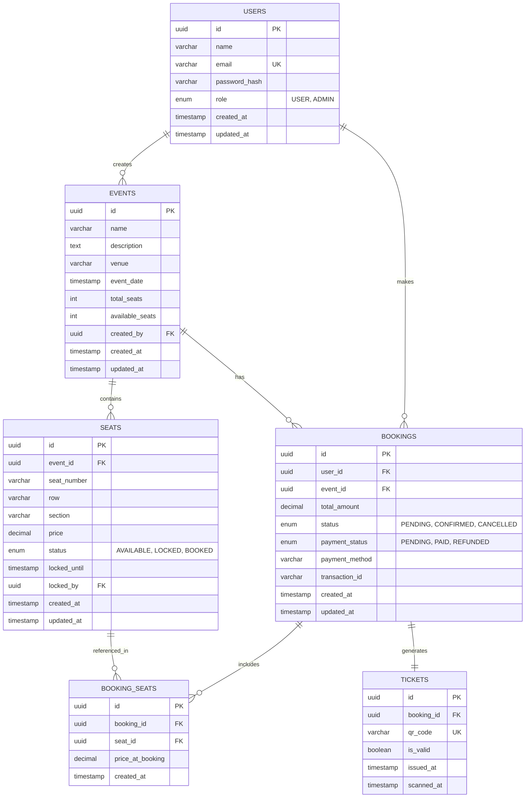

# ER Diagram
## Event Ticket Booking System - Database Schema

### Table Descriptions

#### USERS
- Stores user account information
- Role-based access (USER/ADMIN)
- Password stored as hash for security

#### EVENTS
- Event details and metadata
- Tracks total and available seats
- Links to admin who created it

#### SEATS
- Individual seat records per event
- Status tracking (AVAILABLE/LOCKED/BOOKED)
- Temporary lock with expiry timestamp
- Price per seat for flexible pricing

#### BOOKINGS
- Main booking transaction record
- Links user, event, and payment info
- Status tracking for booking lifecycle
- Stores transaction ID for payment reference

#### BOOKING_SEATS
- Junction table for many-to-many relationship
- Stores price at time of booking (historical data)
- Links bookings to specific seats

#### TICKETS
- Digital ticket with QR code
- One-to-one with booking
- Tracks validation status and scan time

### Key Relationships

1. **User → Bookings** (1:N)
   - One user can make multiple bookings

2. **Event → Seats** (1:N)
   - One event has multiple seats

3. **Event → Bookings** (1:N)
   - One event can have multiple bookings

4. **Booking → Seats** (M:N via BOOKING_SEATS)
   - One booking can include multiple seats
   - One seat can be in multiple bookings (over time)

5. **Booking → Ticket** (1:1)
   - Each confirmed booking generates one ticket

### Indexes (for performance)
- `USERS.email` - Unique index for login
- `SEATS.event_id, status` - Composite index for availability queries
- `SEATS.locked_until` - Index for expired lock cleanup
- `BOOKINGS.user_id` - Index for user booking history
- `TICKETS.qr_code` - Unique index for ticket validation

### Constraints
- Foreign key constraints with CASCADE on delete for data integrity
- Check constraints on enums
- Unique constraints on email and qr_code
- NOT NULL constraints on critical fields
