# Class Diagram
## Event Ticket Booking System - Backend Architecture

```mermaid
classDiagram
    %% Controllers Layer
    class AuthController {
        -authService: AuthService
        +register(req, res)
        +login(req, res)
        +logout(req, res)
    }
    
    class EventController {
        -eventService: EventService
        +getAllEvents(req, res)
        +getEventById(req, res)
        +createEvent(req, res)
        +updateEvent(req, res)
        +deleteEvent(req, res)
        +getEventSeats(req, res)
    }
    
    class BookingController {
        -bookingService: BookingService
        +lockSeats(req, res)
        +processPayment(req, res)
        +getBookingHistory(req, res)
        +cancelBooking(req, res)
    }
    
    %% Services Layer
    class AuthService {
        -userRepository: UserRepository
        -jwtUtil: JWTUtil
        +registerUser(userData): User
        +authenticateUser(email, password): Token
        +validateToken(token): User
    }
    
    class EventService {
        -eventRepository: EventRepository
        -seatRepository: SeatRepository
        +createEvent(eventData): Event
        +updateEvent(id, eventData): Event
        +deleteEvent(id): boolean
        +getEventWithSeats(id): Event
        +searchEvents(filters): Event[]
    }
    
    class BookingService {
        -bookingRepository: BookingRepository
        -seatService: SeatService
        -paymentService: PaymentService
        -ticketService: TicketService
        +lockSeats(eventId, seatIds, userId): Booking
        +processPayment(bookingId, paymentData): Booking
        +cancelBooking(bookingId): boolean
        +getUserBookings(userId): Booking[]
    }
    
    class SeatService {
        -seatRepository: SeatRepository
        +checkAvailability(seatIds): boolean
        +lockSeats(seatIds, userId, duration): boolean
        +releaseExpiredLocks(): void
        +bookSeats(seatIds, userId): boolean
    }
    
    class PaymentService {
        +processTransaction(amount, method): PaymentResult
        +refundTransaction(transactionId): boolean
    }
    
    class TicketService {
        -ticketRepository: TicketRepository
        -qrGenerator: QRGenerator
        +generateTicket(bookingId): Ticket
        +validateTicket(qrCode): boolean
    }
    
    %% Repository Layer
    class UserRepository {
        +create(user): User
        +findByEmail(email): User
        +findById(id): User
        +update(id, data): User
    }
    
    class EventRepository {
        +create(event): Event
        +findAll(filters): Event[]
        +findById(id): Event
        +update(id, data): Event
        +delete(id): boolean
    }
    
    class BookingRepository {
        +create(booking): Booking
        +findById(id): Booking
        +findByUserId(userId): Booking[]
        +update(id, data): Booking
        +delete(id): boolean
    }
    
    class SeatRepository {
        +create(seat): Seat
        +findByEventId(eventId): Seat[]
        +findByIds(ids): Seat[]
        +updateStatus(ids, status): boolean
        +findExpiredLocks(): Seat[]
    }
    
    class TicketRepository {
        +create(ticket): Ticket
        +findByBookingId(bookingId): Ticket
        +findByQRCode(qrCode): Ticket
    }
    
    %% Domain Models
    class User {
        -id: string
        -name: string
        -email: string
        -passwordHash: string
        -role: Role
        -createdAt: Date
        -updatedAt: Date
        +toJSON(): object
    }
    
    class Event {
        -id: string
        -name: string
        -description: string
        -venue: string
        -category: string
        -eventDate: Date
        -totalSeats: number
        -availableSeats: number
        -bannerImage: string
        -createdBy: string
        -createdAt: Date
        -updatedAt: Date
    }
    
    class Seat {
        -id: string
        -eventId: string
        -seatNumber: string
        -row: string
        -section: string
        -price: number
        -status: SeatStatus
        -lockedUntil: Date
        -lockedBy: string
        -createdAt: Date
        -updatedAt: Date
    }
    
    class Booking {
        -id: string
        -userId: string
        -eventId: string
        -seatIds: string[]
        -totalAmount: number
        -status: BookingStatus
        -paymentStatus: PaymentStatus
        -createdAt: Date
        +confirm(): void
        +cancel(): void
        +isExpired(): boolean
    }
    
    class Ticket {
        -id: string
        -bookingId: string
        -qrCode: string
        -issuedAt: Date
        -isValid: boolean
        +generate(): string
        +validate(): boolean
    }
    
    %% Enums
    class Role {
        <<enumeration>>
        USER
        ADMIN
    }
    
    class SeatStatus {
        <<enumeration>>
        AVAILABLE
        LOCKED
        BOOKED
    }
    
    class BookingStatus {
        <<enumeration>>
        PENDING
        CONFIRMED
        CANCELLED
    }
    
    class PaymentStatus {
        <<enumeration>>
        PENDING
        PAID
        REFUNDED
    }
    
    %% Relationships
    AuthController --> AuthService
    EventController --> EventService
    BookingController --> BookingService
    
    AuthService --> UserRepository
    EventService --> EventRepository
    EventService --> SeatRepository
    BookingService --> BookingRepository
    BookingService --> SeatService
    BookingService --> PaymentService
    BookingService --> TicketService
    SeatService --> SeatRepository
    TicketService --> TicketRepository
    
    User --> Role
    Seat --> SeatStatus
    Booking --> BookingStatus
    Booking --> PaymentStatus
    
    Event "1" --> "*" Seat : contains
    User "1" --> "*" Booking : makes
    Event "1" --> "*" Booking : has
    Booking "1" --> "*" Seat : includes
    Booking "1" --> "1" Ticket : generates
```

### OOP Principles Applied

**Encapsulation**
- Private fields with public methods
- Data validation within model classes
- Repository pattern hides database logic

**Abstraction**
- Service layer abstracts business logic
- Repository interfaces abstract data access
- Controllers handle only HTTP concerns

**Inheritance**
- Base Repository class (not shown) for common CRUD
- Base Controller for common middleware

**Polymorphism**
- PaymentService can handle multiple payment methods
- Different seat types can extend base Seat class
