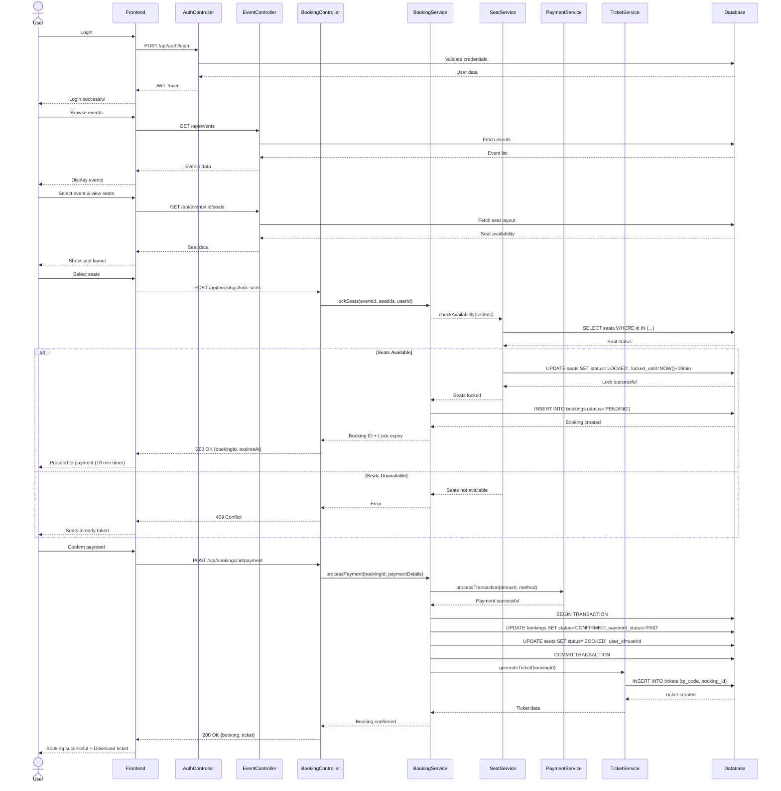

# Sequence Diagram
## Main Flow: Event Ticket Booking (End-to-End)

### Key Flow Points
1. **Authentication**: User logs in and receives JWT token
2. **Event Browsing**: User views available events
3. **Seat Selection**: User selects seats, triggering temporary lock (10 min)
4. **Payment Processing**: User completes payment within lock period
5. **Booking Confirmation**: Transaction commits, seats marked as BOOKED
6. **Ticket Generation**: QR-based digital ticket created and delivered
