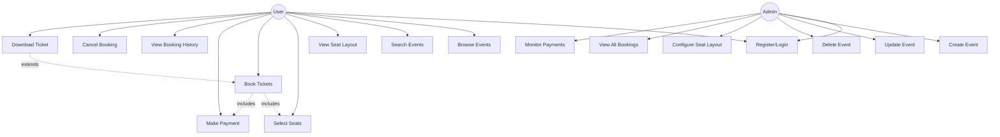

# Use Case Diagram
## Event Ticket Booking System

### Use Case Descriptions

#### User Use Cases
- **UC1: Register/Login** - User creates account or authenticates
- **UC2: Browse Events** - View list of available events
- **UC3: Search Events** - Filter events by name, date, location
- **UC4: View Seat Layout** - See seat arrangement and availability
- **UC5: Select Seats** - Choose desired seats (triggers temporary lock)
- **UC6: Book Tickets** - Confirm seat selection and proceed to payment
- **UC7: Make Payment** - Complete payment transaction
- **UC8: View Booking History** - See past and current bookings
- **UC9: Cancel Booking** - Cancel existing booking and release seats
- **UC10: Download Ticket** - Get QR-based digital ticket

#### Admin Use Cases
- **UC11: Create Event** - Add new event with details
- **UC12: Update Event** - Modify event information
- **UC13: Delete Event** - Remove event from system
- **UC14: Configure Seat Layout** - Define seat arrangement for venue
- **UC15: View All Bookings** - Monitor all user bookings
- **UC16: Monitor Payments** - Track payment transactions
